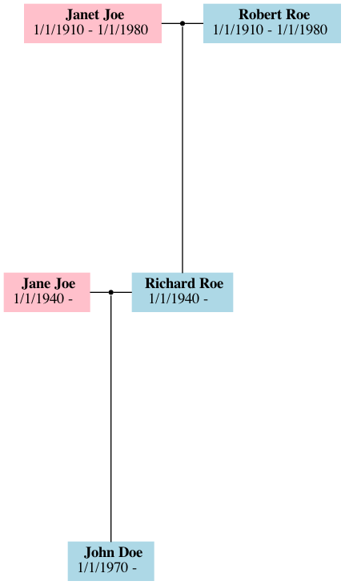

# Genea

Genea is a CLI based genealogic tree editor which allows creating genealogic
tree via commands and without any graphic interface


## Build

To build the binary you can use the `CMakeLists.txt` file with `cmake`, or you
can compile the source yourself
If you use `cmake`, a way to do it is:
```bash
$ mkdir build
$ cd build
$ cmake ..
$ make
```
This will create the `genea` binary

## Usage

`Genea` can be used by piping commands or by a prompt

You can load a file by doing
```bash
$ ./genea <file>
```
of by using the `load` command

When using `genea`, you always are somewhere on the genealogical tree.
You can use several commands to either create a person, move to another one,
or generate a backup or an image of the current tree.
The current person you're on in the tree is reffered as the **cursor**

### Available commands

#### create
Creates a new person in you tree
```
> create John Doe M 3/8/1950
Created person ID 1
Person ID 1
 (M) John Doe
 3/8/1950 -
> create Jane Doe F 12/3/1960 31/8/2003
Created person ID 2
Person ID 2
 (F) Jane Doe
 12/3/1960 - 31/8/2003
```
This commands does not attach the new person to anyone, making it only reachable
from the ID

#### add
This command is similar to `create`, but it also attaches the created person to the
**cursor** as being the (relation)[#relation] you set it to
```
# Cursor is Person ID 1: John Doe
> add father Richard Roe M 5/2/1920
Created person ID 3
Person ID 3
 (M) Richard Doe
 5/2/1920 -
```

#### overwrite
Allows you to modify an already existing person
```
> overwrite Robert Roe M 5/2/1920
Person ID 3
 (M) Robert Roe
 5/2/1920 -
```

#### attach
Attaches a person to another one as being its (relation)[#relation]
```
> attach mother 0 1
```

#### remove
Removes a person from the tree. If a (relation)[#relation] is provided, the person
is just de-attached. If an ID is provided, the person is removed altogether
```
> remove 0
```

#### info
Provides information about the cursor or the (relation)[#relation] provided
```
> info father
Person ID 4
 (M) Richard Doe
 5/2/1920 -
```

#### list
Lists all people present in your tree. Note that it also lists people that might not be
reachable from your cursor
```
> list
Person ID 0
 (M) Robert Roe
 5/2/1920 -
Person ID 1
 (M) John Doe
 3/8/1950 -
Person ID 2
 (F) Jane Doe
 12/3/1960 -
Person ID 3
 (F) Jane Doe
 12/3/1960 - 31/8/2003
Person ID 4
 (M) Richard Doe
 5/2/1920 -
```

#### search
This command is similar to `list`, but filters the first name and the last name
```
> search Doe
Person ID 1
 (M) John Doe
 3/8/1950 -
Person ID 2
 (F) Jane Doe
 12/3/1960 -
Person ID 3
 (F) Jane Doe
 12/3/1960 - 31/8/2003
Person ID 4
 (M) Richard Doe
 5/2/1920 -
```
#### select
Select another person as being the cursor, wether from ID or from (relation)[#relation] of
the current one
```
> select father.mother
Person ID 5
 (F) Jane Doe
 12/3/1960 - 31/8/2003
```

#### dump
Dumps the current tree to a file
```
> dump tree.genea
Tree dumped to tree.genea
```

#### load 
Loads a tree dumped previously. Note that all the people loaded are not connected to the already existing
tree, and can be attached with `attach`. The relations between people from the loaded tree are conserved
```
> load tree.genea
Loaded 5 people
```

#### generate-image
Generates a PNG image of the genealogical tree. This feature requires the graphviz **dot** binary installed in
the host machine. If it is not installed, the DOT file will be dumped to be used in a further use.
The generated image tends to minimize overlap in edges and continuity between generations. However, the generated
tree might not be optimal
```
> generate-image tree.png
Generated PNG file at tree.png
```
An example of generated image: 

### Relations
<a name="relation"></a>

Relations are a core part of `genea`
A relation is a chain of keywords which guides to the wanted related person
#### Simple relations
Simple relations are relations which guide to one person at most
Available simple relations are:
- father
- mother
- child:`<specifier>`
- sibling:`<specifier>`
- spouse:`<specifier>`

When using a simple relation, you can add a `specifier` which will filter on the first name of the person
to get the wanted relation. Not using one will return the first one found.

Simple relations can be used on `select`, `add`, `attach` or `remove` commands

#### Grouping relations
Grouping relations are relations that can be used as last ones in chains to fetch
multiple people in commands which allow it
Grouping commands are:
- children
- siblings

Those last relations can be used in the `info` command

## Contributions

You are free to leave an issue or fork the project in case of any problem/feature you are
wanting to fix or implement
